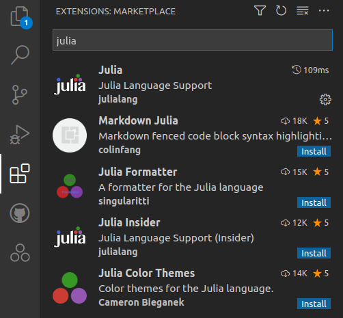
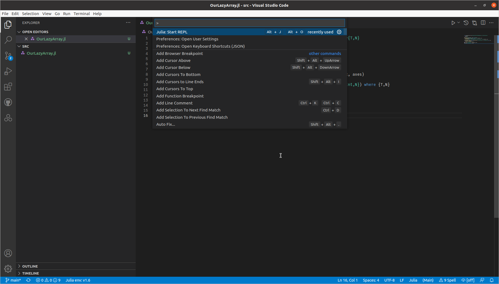
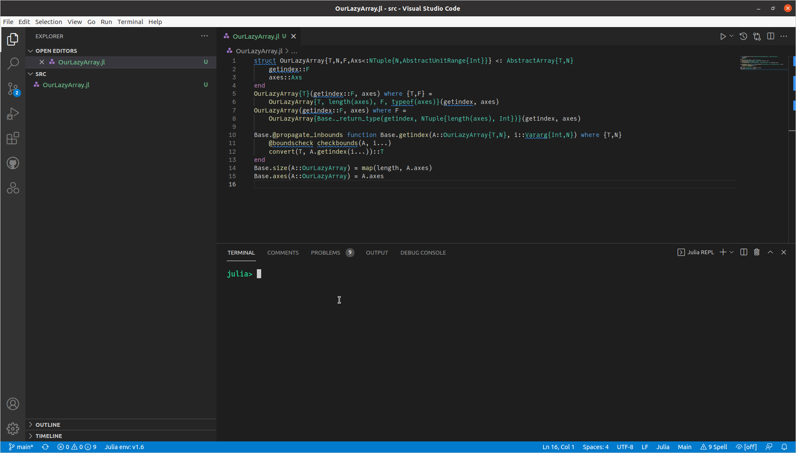

Your first task is to set up an environment for using and writing Julia code. Minimally, this includes Julia, VS Code, and its Julia extension.  Optionally, you might also be interested in Jupyter notebooks (the *Ju* is for Julia, the first language besides *py*thon to support notebooks), a good terminal & shell (for Windows users), and a standalone Git client.

The author is a Linux user, and some advice for Windows and Macs may not be ideal; please provide feedback and help each other on the slack.

# Install Julia

- visit [JuliaLang](https://julialang.org/) and click the Download button (note also the Documentation button and banner links to "Learn" and "Community"; you may visit these later)
- install the *current stable release* for your platform (you almost certainly want the 64-bit version; on Windows, use the "installer" version).

Check your installation by launching Julia, either by double-clicking the application, or launching it by typing `julia` in a shell.  For the latter to work you may need to [adjust your `PATH` variable](https://julialang.org/downloads/platform/).  You should see something like this:

## Windows-specific issues

- [old versions of PowerShell can cause problems](https://discourse.julialang.org/t/antivirus-hit-during-package-install/48706). Recommended solution: run PowerShell 7.
- [antivirus can cause very slow Pkg operations](https://discourse.julialang.org/t/status-of-pkg-speed-improvements-outside-us-in-v1-5/46395/7). Hopefully this won't affect you; if it does, try adding an exclusion for `*.toml` files.  You can also temporarily disable antivirus during package updates. Finally, if you get really annoyed by this, one good option is to [install Windows Subsystem for Linux (WSL)](https://docs.microsoft.com/en-us/windows/wsl/setup/environment) and run Julia (and maybe other programming tasks...) under Linux.  (WSL appears to be quite popular among developers in many programming languages.)

# Install VS Code and extensions

VS Code is a modern, cross-platform, cross-language development environment.  Install [VS Code from here](https://code.visualstudio.com/).

To install the extensions:

- launch VS Code
- click on the extension manager (in the vertical bar at the left):
  

- type `julia` in the search bar and install the first hit, `Julia: Julia Language Support`:
  

- type `GitHub` in the search bar and install the "GitHub Pull Requests and Issues" extension

If you are not already familiar with VS Code, you should spend some time reading the documentation (see the "Docs" in the banner at the top of the VS Code page), particularly the [user interface](https://code.visualstudio.com/docs/getstarted/userinterface).  If you prefer [videos](https://code.visualstudio.com/docs/getstarted/introvideos), the first two ("Getting Started" and "Code Editing") would be the minimum needed to start.

Even if you are familiar with VS Code itself, read the [Julia extension documentation](https://code.visualstudio.com/docs/languages/julia).  More information can be found at the [project site](https://www.julia-vscode.org/).

Finally, perhaps the best way to interact with Julia in VS Code is via the [Command Palette](https://code.visualstudio.com/docs/getstarted/userinterface#_command-palette):

- hit Ctrl-Shift-P in the session:
  

- search for Julia and select it (once you start using it, it will be first and you just hit "Enter"); you should see a Julia [REPL](https://en.wikipedia.org/wiki/Read%E2%80%93eval%E2%80%93print_loop) start:

  

# Optional tools

Some people like Jupyter (the lectures will be delivered in Jupyter, using the [RISE](https://rise.readthedocs.io/en/stable/index.html) extension.

Once we start using Git, you may find that VS Code's built-in Git extension is not quite everything you need.  One popular tool it [GitKraken](https://www.gitkraken.com/).

As a reminder, you can run Julia from within VS Code. Sometimes, I still find myself using the external terminal.  If you are on Windows and decide you want to try an external terminal, don't live with the built-in primitive `cmd` terminal; be sure to install the [Windows Terminal](https://www.microsoft.com/en-us/p/windows-terminal/9n0dx20hk701?rtc=1&activetab=pivot:overviewtab). You may have to install PowerShell as well (I am unsure).
